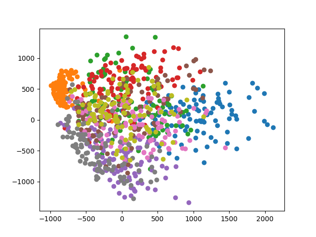
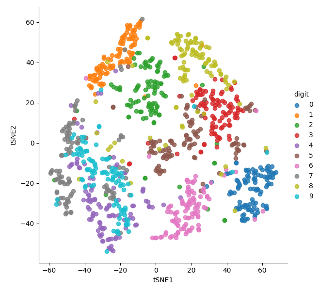
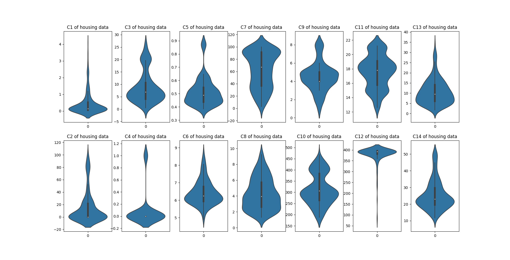

# Data Visualization 
<h3> CAP 4612 </h3>
<h3> Hector Ramirez </h3>
<h3> FIU FALL 2021 </h3>
<h4> 
  Python Version Used: 3.9.6. 

  Required Libraries: pandas, numpy, sklearn, matplotlib, seaborn, sys, os
</h4>

  Source Files: 
-  [mnist-visualizer.py](./mnist-visualizer.py): Takes minstst data csv as command line arguemnt, run using: 
   -    `python mnist-visualizer.py [PATH TO MNIST.CSV]`
- [house_traning.py](./house_training.py): Takes house training data CSV as command line argument. 
  - `python house_training.py [PATH TO HOUSE TRAINING.CSV]`
- [requrements.txt](./requirements.txt) : Used to install librery dependencies.
  -   `pip install -r requirements.txt`

# Table of Contents
- [Data Visualization](#data-visualization)
- [Table of Contents](#table-of-contents)
- [Algorithms](#algorithms)
  - [PCA: Principal Component Analysis](#pca-principal-component-analysis)
    - [Standardization](#standardization)
    - [Covariance Matrix](#covariance-matrix)
    - [Compute Eigenvectors and Eigenvalues](#compute-eigenvectors-and-eigenvalues)
    - [Feature Vector](#feature-vector)
    - [Recast Data](#recast-data)
  - [t-Distributed Stochastic Neighbor Embedding (tSNE):](#t-distributed-stochastic-neighbor-embedding-tsne)
- [Figures](#figures)
  - [MNIST Digit Visualization](#mnist-digit-visualization)
  - [MNIST PCA](#mnist-pca)
  - [MNIST tSNE](#mnist-tsne)
  - [Housing Training Violin Plot](#housing-training-violin-plot)
- [Works Cited](#works-cited)

# Algorithms 

For the first homework, there were several algorithms used to be able to extract or learn new information from the data set provided, both the [MNIST](https://en.wikipedia.org/wiki/MNIST_database) data and the [housing training](https://fiu.instructure.com/courses/109798/files/18124455?wrap=1) data set. The two main algorithms used where the PCA (Principal Component Analysis) and tSNE (t-Distributed Stochastic Neighbor Embedding) 

## PCA: Principal Component Analysis 

Principal Component Analysis is an unsupervised learning algorithm used to reduce the number of dimensions (columns) used in machine learning. It uses a statical approach to attempt to reduce the number of features in the data set while keeping as much relevant information as possible. There are several steps involved in principal component analysis, these are as fallow: 

### Standardization

In this stage the contentious values are placed in the same scale, making sure that each value contributes equally to the overall analysis. The particular reason why performing standardization is that algorithms like PCA are quite sensitive to variances in the data, data with large ranges will dominate over the data with smaller ranges, this will lead to biased results from the algorithm. Mathematically this is accomplished by subtracting the mean and dividing by the standard divination for each value of each variable. 

### Covariance Matrix

In this step we aim to understand how variables in the data set are varying from the mean with respect to each other. In other words, to see if there is any relationship between them; variables can at times be very correlated in such a way they they contain redundant information. In order to identify these relationships, we compute the covariance matrix. 

The covariance matrix is a *p* x *p* symmetrical matrix containing all the possible pairs in the initial data set. A few bits of information can be extracted from the matrix by fallowing some rules. 

Rules:
1. Convergence(a,a) = Variable(a)
2. Convergence(a,b) = Convergence(b,a) (*commutative*)

This means that our convergence matrix is perfectly symmetrical through the diagonal. 

### Compute Eigenvectors and Eigenvalues

_Definitions_: 
- _Eigenvector_: Special set of vectors associated with a linear system of equations, also known as characteristics vectors.  
- _Eigenvalues_: Special set of scalers associated with a liner system of equations, also known as characteristic roots or characteristic values. 

Eigenvectors come in pairs, for each one there is an accompanying Eigenvalue, this number denotes the number of dimensions in the data. The eigenvectors in the convergence matrix actually denotes the axes where there is the most variance and by extensions the most information,  we call these the principal components, after we have all these eigenvectors, we can then rank them to find the vectors with the most significance. 

### Feature Vector

After we have ranked the eigenvectors, we can select which contain the most information of them all. Usually by this point in the process, the most information is contained on the first vector, and the fallowing contain further diminishing data. 

### Recast Data

After the feature vector/s was selected from the step above, the entire data set can no be represented in the principal components axis. 

## t-Distributed Stochastic Neighbor Embedding (tSNE): 

T-distributed stochastic neighbor embedding (T-SNE) is an unsupervised machine learning algorithm developed by Laurens van der Maaten and Geoffrey Hinton for visualization. It models high-dimensional objects between two and three-dimensional points in such a way that similar objects are modeled as close points and unequal objects are likely to be modeled as distant points. 

It constructs a probability distribution for each pair of high-dimensional objects in such a manner that similar objects are assigned a high probability and unequal points are assigned a low probability. The SNE algorithm transforms the Euclidean distance between the higher-dimensional data points into a conditional probability that represents the similarity of the next data point, which means the highest similarity. The algorithm defines a similar probability distribution between the points on the underdimensional map and minimizes Kullback-Leibler (KL) divergence between the two distributions in terms of the location of the points on the map.

When conditional probability distributions between data points with high- and low-dimensional representations are calculated, the algorithm aims to minimize the discrepancy between the two representations. The conversion of the original data into new data preserves the variance of the original using eigenvalues. nts an optimization problem for T-SNE.

# Figures 

In this section we will go over the output of the PCA, tSNE and Violin Plot for the Assignment. 

## MNIST Digit Visualization

This is a sample of the digits in the MNIST Data, this is used to provide some context to the data which is being worked with. 

## MNIST PCA

Here PCA has allowed us to reduce the number of dimensions in our data, allowing us to represent the data in 2 dimensions from the original 700+ dimensions. Even at this stage we can begin to observe some clustering occurring in the digits, while the bulk of the samples are clustered around the 0,0 mark. 

## MNIST tSNE

tSNE has provided us a much clearer look at how our samples are distributed in the new features created by tSNE. More importantly we can begin to see how each digit begin to cluster around some sections of the graph, while other digits which share a lot of common features begin to cluster together. An example here would be 4 (purple)  and 9 (light blue), as we can see from the tSNE these digits have a lot of features in common, and thus most of their data points are represented very close to one another. 

## Housing Training Violin Plot

The violin plot in the image provides a clear perspective as to the distribution of values in the provided CSV. The violin plot is exceptionally good at visualizing where most values are located, as well as the overall distribution of those values in the data set. For example in Column 1 of the data set, we can observe how most of the values cluster around 0, while in the Column 12, most of the values cluster around 400. 

# Works Cited

These websites were essential in understanding how the algorithms used in the project worked and to gain a deep understanding. 

1. [Step By Step PCA](https://builtin.com/data-science/step-step-explanation-principal-component-analysis)
2. [Eigenvector & Eigenvalues Definitions](https://www.google.com/url?sa=t&rct=j&q=&esrc=s&source=web&cd=&cad=rja&uact=8&ved=2ahUKEwicuIPyufDyAhXPSzABHWbLDAsQFnoECA8QAw&url=https%3A%2F%2Fmathworld.wolfram.com%2FEigenvector.html&usg=AOvVaw1d1iN4NCLrk3Rp4M1hGLqS)