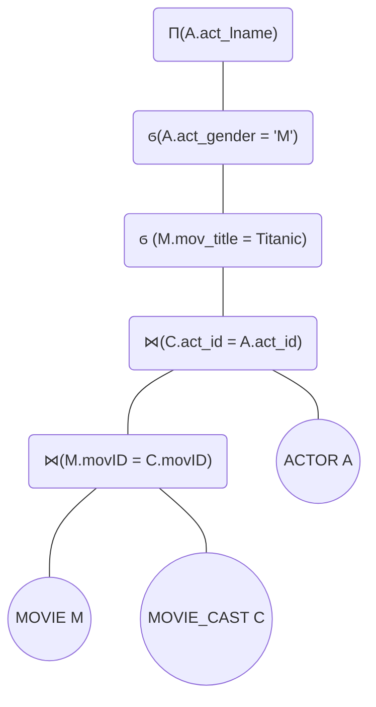
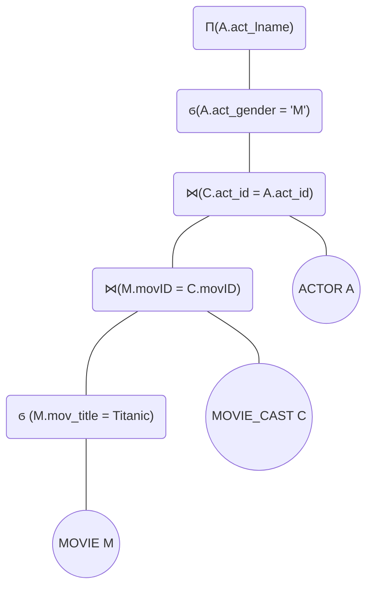
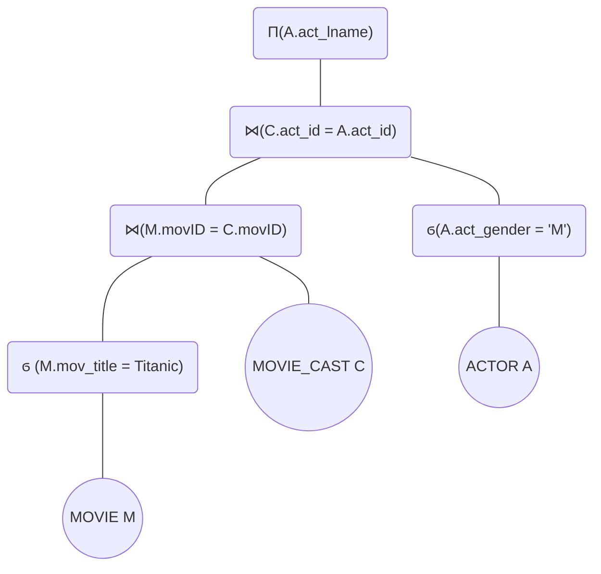
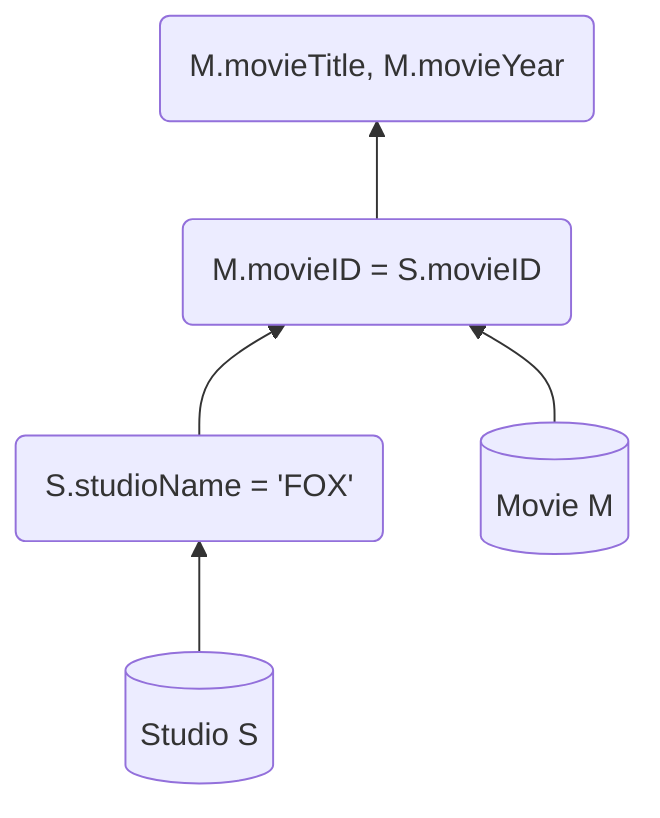

<h1>Assigment # 1 </h1>

<h3> Hector M. Ramirez. </h3>
<h3> Panther ID: ######## </h3>

<h3>COP 4751: Advanced Database Management</h3>

<h3>Desclaimer: Graphs in this document are rendered using Mermaid Markdown framework. </h3>

<div style="page-break-after: always;"></div>

<h1> Table Of Contents </h1>

- [Question 1](#question-1)
- [Question 2](#question-2)
  - [Initial Query Tree](#initial-query-tree)
  - [Slightly Optimized Query Tree](#slightly-optimized-query-tree)
  - [Optimized Query Tree](#optimized-query-tree)
- [Question 3](#question-3)
  - [Initial Query Tree](#initial-query-tree-1)
- [Originality Declaration](#originality-declaration)


<div style="page-break-after: always;"></div>

## Question 1

Write the SQL queries for the following items, considering the SQL Query Optimization Techniques studied in class.

A. Retrive the name, original language, and year of the movies.

 ```sql
    SELECT mov_name, mov_lang, mov_year 
    FROM movie
```

B. Retrive title and language of all USA release country movies which were released between Jan/01/2019 and December/31/2020

```sql
    SELECT mov_title, mov_lang 
    FROM movie
    WHERE mov_rel_country = "USA" 
    AND mov_year >= 2019 
    AND mov_year <= 2020
```

C. Retrive a list of first names of all the actors who were cast in the movie "The Godfather" and the roles they played in the production.

```sql
    SELECT act_fname, act_lname, role 
    FROM actor, movie, movie_cast, 
    WHERE movie_cast.act_id = actor.act_id 
    AND movie_cast.mov_id = movie.mod_id 
    AND movie.mov_title = "The Godfather"
```

<div style="page-break-after: always;"></div>

## Question 2

Write the SQL queries for the following items, considering the SQL Query Optimization Technigues studied in class.

A. List all the actors who have not acted in any movie between 1990 and 2003

```sql
SELECT A.act_name, A.act_lname, 
FROM movie M, movie_cast C, actor A,
WHERE A.act_id = C.act_id 
AND C.mov_id = M.mov_id
AND M.mov_year < 1990
OR M.mov_year > 2003

```

B. Find how many movies are there in each genre.

```sql
    SELECT gen_title, COUNT(gen_title) 
    FROM movie
    NATURAL JOIN  movie_genres
    NATURAL JOIN  genres
    GROUP BY gen_title
```

C Consider the following query specified on Movie Database:

```sql
    SELECT A.act_lname
    FROM actor A, movie_cast C, movie M 
    WHERE M.mov_title = "Titanic" 
    AND M.mov_id = C.mov_id
    AND A.act_id = C.act_id 
    AND A.act_gender = "M"
```

1. Draw the initial query tree, then draw the resulting query trees after the application of the following heuristic optimization query steps.
   1. Moving SELECT operations down the query tree.
   2. Applying the more restrictive SELECT operation first.

<div style="page-break-after: always;"></div>

<center>

### Initial Query Tree



</center>
<div style="page-break-after: always;"></div>

<center>

### Slightly Optimized Query Tree



</center>
<div style="page-break-after: always;"></div>

<center>

### Optimized Query Tree



</center>
<div style="page-break-after: always;"></div>

## Question 3

Consider the following database schema:

```schema
    Movie(movieID, title, length, year)
    Studio(movieID, studioName)
```

a. Write down the query to find the titles and years of movies made by "FOX" that are at least 100 minutes long.

```sql
    SELECT M.title, M.year 
    FROM Movie M, Studio S
    WHERE S.studioName = "FOX"
    AND S.movieID = M.movieID
    AND M.mov_time >=100
```

b. Show the initial query tree.

### Initial Query Tree



<div style="page-break-after: always;"></div>

## Originality Declaration

=============== Originality Declaration =====================

Name: Hector Ramirez

Panther-ID: _______

Course: COP-4751

Assignment#: 1

Due:

I hereby certify that this work is my own and none of it is the work of any other person.

Signature: Hector Ramirez

=========================================================
