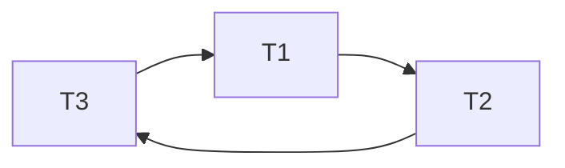
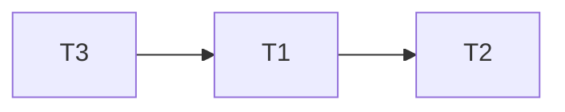
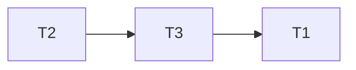
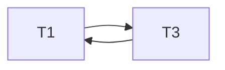
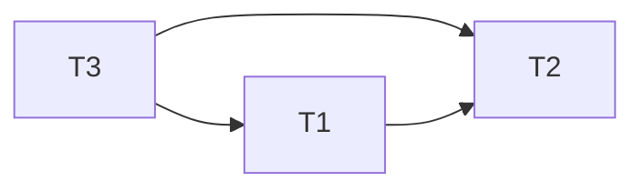

# Question 1

Consider the three transactions T1, T2and T3, and the schedules S1, S2, S3 and S4  given  below.  Which  ofthe  schedules  is conflictserializable?  The  subscript  for  each database operation in a schedule denotes thetransaction number for that operation. For each schedule,  show  all  conflicts,  draw  the  precedence  graph,determine  and  write  down  if  it  is serializable or not, and the equivalent serial schedules if exist

## Transactions

T1: R1(X), W1(X)

T2: R2(X)

T3: R3(X) W3(X)

## Schedules

S1: R1(X) R3(X) W1(X) R2(X) W3(X)

S2: R1(X) R3(X) W3(X) W1(X) R2(X)

S3: R3(X) R2(X) W3(X) R1(X) W1(X)

S4: R3(X) R2(X) R1(X) W3(X) W1(X)

## Schedule 1

### S1: R1(X) R3(X) W1(X) R2(X) W3(X)

| T1 | T2 | T3 |
| - | - | - |
| R1(X) | | |
| | | R3(X) |
| W1(X) | | |
| | R2(X) | |
| | | W3(X) |

### Schedule 1 Graph

### S1 is not conflict serializable, cycle detected in graph

## Schedule 2

### S2: R1(X) R3(X) W3(X) W1(X) R2(X)

| T1 | T2 | T3 |
| - | - | - |
| R1(X) | | |
| | | R3(X) |
| | | W3(X) |
| W1(X) | |
| | R2(X) |

### Schedule 2 Graph

### Schedule 2 is Conflict Serializable in the type T3->T1->T2

### Schedule 2 Conflict Serialized: R3(X) W3(X) R1(X) W1(X) R2(X)

## Schedule 3

### S3: R3(X) R2(X) W3(X) R1(X) W1(X)

| T1 | T2 | T3 |
| - | - | - |
| | | R3(X) |
| | R2(X) |
| | | W3(X) |
| R1(X) | | |
| W1(X) | | |

## Schedule 3 Graph

### Schedule 3 is Conflict Serializable in the Type T2->T3->T1

### Schedule 3 Conflict Serialized: R2(X) R3(X) W3(X) R1(X) W1(X)

## Schedule 4

### S4: R3(X) R2(X) R1(X) W3(X) W1(X)

| T1 | T2 | T3 |
| - | - | - |
| | | R3(X) |
| | R2(X) | |
| R1(X) | |
| | | W3(X) |
| W1(X) | | |

### Schedule 4 Graph

### Schedule 4 is NOT Conflict Serializable, Cycle detected on graph between T1 and T3

# Question 2

Consider 3 transactions, T1, T2, T3, and the schdules S5 and S6 given bellow. Show all conflicts and draw the serializability (precedence) graphs for S5 and S6, and state weather each schdule is serializeable or not. If a schedule is serializable write down the equivalent serial schedule(s)

## Transactions

T1: R1(X) R1(Y) W1(X)

T2: R2(Z) R2(Y) W2(Z) W2(Y)

T3: R3(X) R3(Y) W3(Y)

## Schedules

S5: R1(X) R2(Z) R1(Z) R3(X) R3(Y) W1(X) C1 W3(Y) C3 R2(Y) W2(Z) C2

S6: R1(X) R2(Z) R1(Z) R3(X) R3(Y) W1(X) W3(Y) R2(Y) W2(Z) C1 C2 C3

## Schedule 5

| T1 | T2 | T3 |
| - | - | - |
| R1(X) | | |
| | R2(Z) | |
| R1(Z) | | |
| | | R3(X) |
| | | R3(Y) |
| W1(X) | | |
| C1 | | |
| | | W3(Y) |
| | | C3 |
| | R2(Y) | |
| | W2(Z) | |
| | W2(Y) | |
| | C2 | |

### Schedule 5 Graph

### Schedule 5 can be serialized in the type of  T3-> T1 -> T2

### S5 Serialized: R3(X) R3(Y) W3(Y) C3 R1(X) R1(Z) W1(X) C1 R2(Z) R2(Y) W2(Z) W2(Y) C2

## Schedule 6

S6: R1(X) R2(Z) R1(Z) R3(X) R3(Y) W1(X) W3(Y) R2(Y) W2(Z) C1 C2 C3

| T1 | T2 | T3 |
| - | - | - |
| R1(X) | | |
| | R2(Z) | |
| R1(Z) | | |
| | | R3(X) |
| | | R3(Y) |
| W1(X) | | |
| | | W3(Y) |
| | R2(Y) | |
| | W2(Z) | |
| C1 | | |
| | C2 | |
| | | C3 |

### Schedule 6 Graph

### Schedule 6 can be serialized in 

